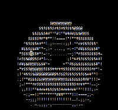
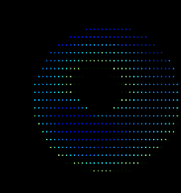
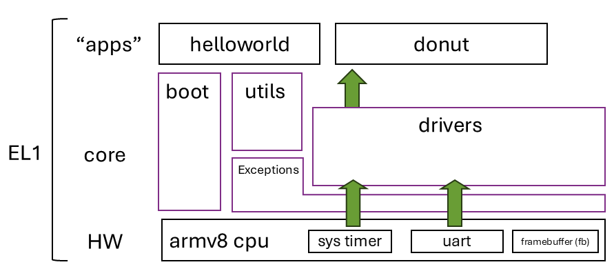

# UVA-OS WORLD1 "Baremetal" 
## To UVA students: the code will become available in Sp25

This is one part of the UVA-OS class (CS4414/CS6456). 

[OVERVIEW](https://github.com/fxlin/cs4414-main) |
[WORLD1](https://github.com/fxlin/uva-os-world1) |
[WORLD2](https://github.com/fxlin/uva-os-world2) |
[WORLD3](https://github.com/fxlin/uva-os-world3) |
[WORLD4](https://github.com/fxlin/uva-os-world4) |
[WORLD5](https://github.com/fxlin/uva-os-world5) 

### Students: see [quests-lab1.md](quests-lab1.md)

## GALLERY



## DESIGNS

A single CPU core can boot, print messages from UART, and display pixels. Interrupts work, enabling periodic rendering of a simple "donut" animation. Everything runs in privileged mode (EL1).



✅ UART/printf 
✅ Timers (&multiplexing)
✅ Interrupts
✅ Framebuffer & animation

⛔ No multitasking 
⛔ EL1 only


## Build for rpi3 QEMU

To clean up:
```sh
./cleanall.sh
```

To build everything:
```sh
export PLAT=rpi3qemu
./makeall.sh
```

To run on qemu:
```sh
./run-rpi3qemu.sh
```

## Build for rpi3 (hardware)

To clean up:
```sh
./cleanall.sh
```

To build everything:
```sh
export PLAT=rpi3
./makeall.sh
```

(One time): get a blank SD card, burn the provided image with Win32DiskImager, 
balenaEtcher, or Raspberry Pi Imager. 

Copy the kenrel image `kernel8.img` to the partition named `bootfs` and boot. 