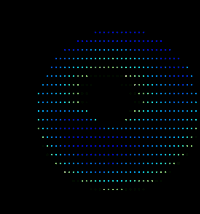

# UVA-OS Lab1 "Baremetal" 

This is one part of the UVA-OS class (CS4414/CS6456). 

[OVERVIEW](https://github.com/fxlin/cs4414-main) |
[LAB1](https://github.com/fxlin/uva-os-world1) |
[LAB2](https://github.com/fxlin/uva-os-world2) |
[LAB3](https://github.com/fxlin/uva-os-world3) |
[LAB4](https://github.com/fxlin/uva-os-world4) |
[LAB5](https://github.com/fxlin/uva-os-world5) 


### Students: see [quests-lab1.md](quests-lab1.md)

## GALLERY



## DESIGNS

A single CPU core can boot, print messages from UART, and display pixels. Interrupts work, enabling periodic rendering of a simple "donut" animation. Everything runs in privileged mode (EL1).


✅ UART/printf 
✅ Timers (&multiplexing)
✅ Interrupts
✅ Framebuffer & animation

⛔ No multitasking 
⛔ EL1 only


## QUICKSTART

### For rpi3 (QEMU)

```
export PLAT=rpi3qemu
```

| Action                      | Command                   |
|-----------------------------|---------------------------|
| To clean up                 | `./cleanall.sh`           |
| To build everything         | `./makeall.sh`            |
| To run on qemu              | `./run-rpi3qemu.sh`       |
| Launch qemu for debugging   | `./dbg-rpi3qemu.sh`       |

### For rpi3 (hardware)
```
export PLAT=rpi3
```

| Action              | Command             |
|---------------------|---------------------|
| To clean up         | `./cleanall.sh`     |
| To build everything | `./makeall.sh`      |

(One time): Prepare the SD card

https://github.com/fxlin/uva-os-main/tree/main/make-sd

<!-- get a blank SD card, burn the provided image with Win32DiskImager, 
balenaEtcher, or Raspberry Pi Imager.  -->

Copy the kernel image `kernel8.img` to the partition named `bootfs` and boot. 