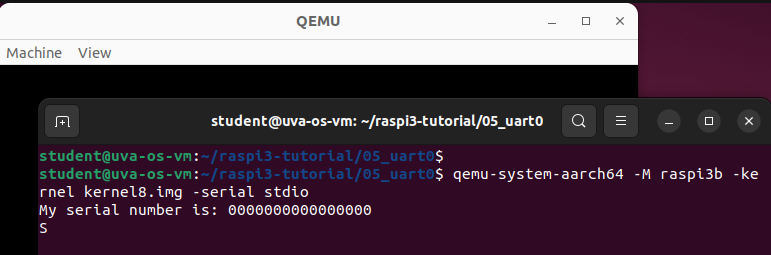
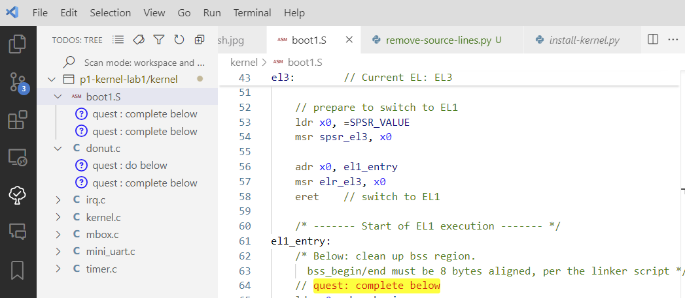

# Quest Description for World 1:"Baremetal"

Total estimated time: XXX hours

<!-- convert image-1.png -resize 500x image-1-resized.png -->


| Quest Name | Description | Credits |
|------------|-------------|---------|
| [Quest01: setup](#quest01-setup) | Install necessary tools and set up the environment | 0 |
| [Quest02: kernel image](#quest02-kernel-image) | Build and inspect the kernel image | 5 |
| [Quest03: boot](#quest03-boot) | Complete boot.S to boot the kernel | 15 |
| [Quest04: UART](#quest04-uart) | Bring up UART for kernel debugging | 15 |
| [Quest05: textual donut](#quest05-textual-donut) | Implement system timer for timed animation | 10 |
| [Quest06: OS logo](#quest06-os-logo) | Display OS logo and name on the screen | 10 |
| [Quest07 (side): debug level](#quest07-side-debug-level) | Control debug messages using macros | 5 |
| [Quest08 (side): framebuffer offsets](#quest08-side-framebuffer-offsets) | Explore framebuffer virtual offsets | 5 |
| [Quest09: sys_timer irq](#quest09-sys_timer-irq) | Enable system timer interrupt | 15 |
| [Quest10: pixel donut](#quest10-pixel-donut) | Implement pixel donut animation | 15 |
| [Quest11 (side): virtual timers](#quest11-side-virtual-timers) | Implement virtual timers for animations | 15 |
| [Quest12 (side): UART rx irq](#quest12-side-uart-rx-irq) | Enable UART receive interrupts | 10 |
| [Quest13 (side): rpi3](#quest13-side-rpi3) | Reproduce checkpoints on a real Rpi3 | 30 |

#### Total credits: 150 (main 85; side 65)
Credits exceeding 100 will be considered as bonus.


## Preface

### About this document

A document like this (quest description): 
- provides a high-level overview of the quests;
- tells you the goals and major steps; 
- points you to the corresponding source code. 

This document does NOT: 
- provide detailed instructions.

The detailed instructions are always as comments in the source
code. Search for "quest:" in the source code, or highlight them using vscode's
TODO Tree plugin.

### What's the lab structure?
The whole semester has five labs, each based on a specific OS codebase (1--5). Each lab comprises a sequence of "quests." 

Labs are conceptually incremental; but they have low or weak dependencies. 
This means that in most cases, even if you haven't finished certain features for earlier labs, you won't be disadvantaged in subsequent labs. 

Within a lab, quests may have dependencies, so you are advised to complete quests in order. 

A quest comprises multiple steps; for quests in labs 1--3, these steps are largely sequential.

### What are CHECKPOINTS? 

You will see "CHECKPOINTS" in the quest description from time to time. 
They mean that you should have accomplished a major feature, e.g. a syscall. 
You should test the feature. 
The feature may not be easily demonstratable. 

There is nothing to submit for CHECKPOINTS.

### What are DELIVERABLES? 

You will see "DELIVERABLES" in the quest description from time to time.
They mean that you need to demonstrate a feature, e.g., showing an animation on screen. 

In this course, DELIVERABLES are mostly 📷 videos or photos, or sometimes 📝 writeups, for which we have specific requirements. See [here](submission.md). 

Not all quests have DELIVERABLES. For instance, a quest without DELIVERABLE can be prerequisite for the later ones. 

### How does a lab submission look? 

See [here](submission.md) for a detailed description of the submission format.


## Quest01: setup 

### How to choose?  
- All: try VMWare first; 
- We will provide download links for VMWare Workstation 17 Player
- If VMWare does not work for you (e.g. your machine becomes to slow):
  - Windows users: try WSL2
  - Mac users: get a loaner Windows laptop from CS IT; try WSL2
  - Linux users: try native. 

| Your local machine: | Can run ...    |
| ------------------------ | ---------------------- |
| Windows                  | VMware or WSL2 (WSL won't work) |
| Mac                      | VMware Workstation |
| Linux                    | Ubuntu 22.04 native or VMware Player Workstation              |


### Instructions for VM users

* [instructions](vmware.md): How to install VMware Workstation Player on Windows or Mac. 

### Instructions for non-VM users

* [instructions](wsl2.md): How to install WSL2 on Windows


Note: 
* We only support Ubuntu 22.04. 

* Other OS/compiler versions are possible but unsupported. 

* In writing below, we will refer to users using VMware Player as "VM users". 

* CS undergraduates are eligible for a PC laptop loaner from the CS IT 

### install toolchain (already done for VM users)

VM users: skip the "apt" commands. Toolchains are already installed. 

````bash
sudo apt update
sudo apt install -y gcc-9-aarch64-linux-gnu g++-9-aarch64-linux-gnu
sudo apt install -y gdb-multiarch
# other useful goodies
sudo apt install -y tmux build-essential git
````

NB: Must be gcc-9. Newer gcc is known to break some kernel code. 

Set up gcc-9 as the default compiler: 
````
sudo update-alternatives --install /usr/bin/aarch64-linux-gnu-gcc aarch64-linux-gnu-gcc /usr/bin/aarch64-linux-gnu-gcc-9 100
sudo update-alternatives --config aarch64-linux-gnu-gcc
````


Verify:
````
aarch64-linux-gnu-gcc-9 --version

aarch64-linux-gnu-gcc-9 (Ubuntu 9.5.0-1ubuntu1~22.04) 9.5.0
Copyright (C) 2019 Free Software Foundation, Inc.
This is free software; see the source for copying conditions.  There is NO
warranty; not even for MERCHANTABILITY or FITNESS FOR A PARTICULAR PURPOSE.
````

### install gdb (already done for VM users)
VM users: skip the "apt" command. 
````
sudo apt install -y gdb-multiarch
````

Install the "dashboard" enhancement
````
wget -P ~ https://raw.githubusercontent.com/fxlin/uva-os-main/main/.gdbinit
````

### install qemu (already done for VM users)
VM users: skip the "apt" command
````
sudo apt install -y qemu-system-aarch64
````


Verify: 
````
qemu-system-aarch64 --version

QEMU emulator version 6.2.0 (Debian 1:6.2+dfsg-2ubuntu6.18)
Copyright (c) 2003-2021 Fabrice Bellard and the QEMU Project developers
````

### test toolchain & qemu (already done for VM users)

The command below tests your QEMU installation with Rpi3 emulation (NOTE: this repo is for validating your
toolchain & QEMU build; it is NOT our course project)

````
git clone https://github.com/fxlin/raspi3-tutorial.git
cd raspi3-tutorial
git checkout master
cd 05_uart0
make 
qemu-system-aarch64 -M raspi3b -kernel kernel8.img -serial stdio
````

Expected output: 
````
My serial number is: 0000000000000000
````



>  Note: the test program runs an infinite loop which will cause high CPU usage
>  on your host machine. Use ctrl-c to kill QEMU. 

## vscode (already done for VM users; non-VM users: optional but recommended)

> This is a side quest. VM users: skip this quest; you already have vscode and plugins installed.

    Side quests: 
    - carry bonus points. 
    - are fun and rewarding (e.g. building features that will help you in the main quests).
    - are not prerequisites for main quests. Even if you skip all side quests, you can still get full credit.
    - have fewer instructions than main quests.
    - are numbered in the same way, and submitted in the same way, as main quests. 

install vscode on your local machine. 

| User type | Install vscode ...   |
| ------------------------ | ---------------------- |
| WSL2                  | on Windows; use vscode to connect to the WSL target       |
| Linux native           | natively  |
| VM                    |  inside the VM |

recommended vs plugins: 

- Arm Assembly
- Bookmarks (for navigating in large codebases)
- C/C++ Themes
- Project Manager (for managing multiple codebases) 
- Remote Development (Windows WSL target)
- Remote Explorer
- WSL (Windows only)
- C/C++
- GitHub Copilot
- Todo Tree (highlight todo keywords) 

useful hotkeys: 

- ctrl+p go to files
- ctrl+t go to a symbol
- ctrl+shift+f search text in all files 
- ctrl+\ open the current file in a split view
- ctrl+j toggle bottom panel
- ctrl+b toggle left panel
- ctrl+alt+click open the function in the other split view

😀 DELIVERABLE: This quest has no deliverables.

## Quest02: kernel image

OVERVIEW: you will build the kernel image (kernel8.img) and inspect it.

Clone this git repo. Assume the path to be under your home path, e.g. 
`~/uva-os-world1/`. 

````
export PLAT=rpi3qemu
./makeall.sh
````

Verify: the output kernel (elf): 
````
file kernel/build-rpi3qemu/kernel8.elf
````

Inspect the kernel elf file. Refer to our short [writeup](dump.md) or ask
ChatGPT. 

Make sure you understand the difference between .elf and .img files

😀 DELIVERABLE. In 1-2 sentences, answer the questions below: 

- What are these sections in the elf file?

- What is the address of symbol kernel_main? What are the first 8 bytes at the
    symbol? What are the corresponding instructions? 

- How many bytes does each aarch64 instruction contain? 

- How is kernel8.img generated out of kernel8.elf?

- Now examine kernel8.img (use the hexdump command or the VSCode plugin). Search
    for the first 8 bytes of kernel_main(). Can you find it? At which offset of
    kernel8.img? 

## Quest03: boot 

OVERVIEW: complete boot.S so that the kernel boots to kernel_main() in kernel.c.
This quest also shows how to use GDB (important). 

> The credits for this quest are evenly split among multiple deliverables.

### Launch GDB

In a window: 
````
./dbg-rpi3qemu.sh
````

In a different terminal window: 

````
gdb-multiarch
````

which shall read ~/.gdbinit and loads `kernel/build-rpi3qemu/kernel8.elf`
because that is what is inside .gdbinit. To override that path, do 
````
gdb-multiarch mypath/kernel8.elf
````

<!-- {width=200px} -->


More info on GDB (common commands, etc): 
we will cover in lectures;
refer to our short [writeup](gdb.md); 
ask ChatGPT. 

### Debug the kernel: single step

With GDB, start from the kernel `_start`, single step (per instruction). Compare
the instructions displayed on GDB to the assembly code in `boot.S`.  

Do the single step until you execute the instruction `eret`. Have you observed change in the EL displayed by GDB? 

😀 DELIVERABLE: Take a photo of the GDB screen. Follow [requirements](./submission.md).

### Coding: complete boot.S

**NOTE**. In the description below (and in the future), we will refer to C function names and assembly
labels. We do not always give out the full file paths. 
To quickly locate them, use vscode `ctrl+t` for C functions and `ctrl+shift+f` for assembly labels.

**NOTE**. In all coding exercise, always see the comments in the code for hints
and instructions.

**NOTE**. If you configured vscode and Todo-tree as described above, you can see all the quests lighlighted and listed in the Todo-tree panel.



STEPS

- complete the code at `el1_entry` (as instructed by the code comments)

- complete the code at `setup_sp` (as instructed by the code comments)

- set a breakpoint at the first printf() call in kernel_main(). run the kernel
until the breakpoint is hit. 

😀 DELIVERABLE: take a photo of the GDB screen. Follow [requirements](./submission.md).

## Quest04: UART 

This quest is about bringing up the UART (which does poll only at this time). 
UART is our primary I/O device for kernel debugging. 

Grasp the high-level idea of `mini_uart` (mini_uart.c) and `printf()` (printf.c).

In `mini_uart.c`, complete `uart_send()` (as instructed by the code comments). 

In `kernel_main()`, before the first call to `printf()`, call `uart_init()` and
`init_printf()`, as instructed by the code comments. 

😀 DELIVERABLE: take a photo of kernel printing the following messages: 
````
------ kernel boot ----- core 0
build time (kernel.c) ...
````

## Quest05: textual donut

OVERVIEW: you will bring up sys_timer, which provide delays for timed animation. But no interrupts enabled yet.

- in `timer.c`, complete the core function of kernel timekeeping: `current_counter()`, which
returns the current value of the system timer. 

- complete the delay functions (through busy waiting): `ms_delay()` and
`us_delay()`.

- read `donut_text()` and roughly understand what it does. 

- in `kernel_main()`, call `donut_text()` see the timed animation on uart
    output. 


### Change luminance of Donut (optional)

- in `donut_text()`, change the luminance of the donut by modifying how it fills
    buffer b with different characters. 

😀 DELIVERABLE: 
shoot a short video of the donut animation. 
Reference (Note: your submission must meet the [requirements](submission.md)): 


## Quest06: OS logo

OVERVIEW: you will bring up the framebuffer, needed for graphical display.

- Read `mbox.c`, grasp how framebuffer works in general. 

- in `mbox.c`, complete the framebuffer initialization function `do_fb_init()`.

- complete the function that displays the OS logo and name: `fb_showpicture()`.

### change the OS logo and name (optional)

😀 DELIVERABLE: take a photo of the OS logo and name displayed on the
screen.

## Quest07 (side): debug level
> This is a side quest.

- in mbox.c, switch the KERNEL DEBUG_XXX macro to show different sets of debug
    messages.

- in Makefile, toggle CONFIG_GLOBAL_DEBUG_LEVEL to control different sets of
    debug messages.

- Read the comments in Makefile and debug.h, understand how these two work together to control the
    debug messages.


## Quest08 (side): framebuffer offsets
> This is a side quest.

Explore the framebuffer virtual offsets.

- try out `test_fb_voffset()` in (unittest.c). Read the code and understand what
    it does.

- place a call to `test_fb_voffset()` in `kernel_main()`.

- understand what the virtual offsets are, and why the code does not work as
    expected.

- find a fix (without modifying QEMU) so that the test works as expected.

😀 DELIVERABLE: shoot a short video. 

## Quest09: sys_timer irq

OVERVIEW: bring up the sys_timer irq, needed for timed animation.

- understand the table of exception vectors (`vectors:` in `entry.S`).

- in the vector table, place `el1_irq` at the right place.

- in entry.S, complete the assembly macro `kernel_entry`, with the help of GDB and AI.

- in kernel_main(), enable the CPU irq. Look for an existing function in `util.S`.

CHECKPOINT. with the help of GDB or debug print, verify that the timer irq is fired:
    i.e. `handle_irq()` (irq.c) is called. Understand why is `handle_irq()` called just one-shoot or periodically. 

There is no DELIVERABLE for this quest. Continue below to enable animation. 

## Quest10: pixel donut

OVERVIEW: bring up the pixel donut animation.

- Understand the key functions of the Donut: 
`donut_simple()`, `sys_timer_irq_simple()` and `draw_frame()` (donut.c).

- complete the function `sys_timer_irq_simple()` (donut.c).

- in the system's irq handler (irq.c), place the call to `sys_timer_irq_simple()` (donut.c).

- Place a call to `donut_simple()` in `kernel_main()`.

### change the donut's color tone to your like (optional)

- by modifying `draw_frame()` (donut.c), change the color tone of the donut.


😀 DELIVERABLE: shoot a short video (5-10sec) of the donut animation.

Reference below. Note: your submission must meet the [requirements](submission.md).


NOTE: you may see qemu crash occasionally with a segmentation fault (segfault) like this. 
After that, the terminal becomes unusable, not echoing any key inputs. 


It's a QEMU bug. Interested readers can see my analysis in this [doc](fb-bug/notes-qemu-fb-bug.md); 
VM users should be fine: I already applied my fix to the QEMU9 shipped with the VM image. 
For WSL2 users, you just kill the faulty QEMU and start a new one
(the segfault won't happen every time, and it seems less frequent than on VM/Linux); 
if it really bothers you, just compile QEMU from source with my [fixes](fb-bug).


## Quest11 (side): virtual timers
> This is a side quest.

- complete `sys_timer_irq()` and `adjust_sys_timer()` (timer.c).

- CHECKPOINT. test the virtual timers with `test_ktimer()` (unittest.c); place a call to
    `test_ktimer()` in `kernel_main()`.

- in `handle_irq()`, replace the call to `sys_timer_irq_simple()` with
    `sys_timer_irq()`, which is a generic timer irq handler.

- understand `donut()` (donut.c) and how it uses the virtual timers. Place a call to `donut()` in `kernel_main()`.

- see the donut animation with the virtual timers.

😀 DELIVERABLE: shoot a short video (5-10sec) of the donut animation.

## Quest12 (side): UART rx irq (receive interrupts)
> This is a side quest.

- understand what `test_ktimer2()` (unittest.c) does.

- complete the function `uart_init()` (mini_uart.c) to enable the UART receive
    interrupt.

- complete the function `uart_irq()` (mini_uart.c) to handle the UART receive
    interrupt. Place a call to `test_ktimer2()` in `uart_irq()`.

- Try: use terminal keystroke to start/kill periodic kernel messages as driven by virtual timers.

😀 DELIVERABLE: shoot a short video (5-10sec)

## Quest13 (side): rpi3 

Reproduce all above CHECKPOINTS on a real Rpi3

> This is a side quest.

😀 DELIVERABLE: shoot multiple short videos (5-10sec each) of the real Rpi3 output. 

